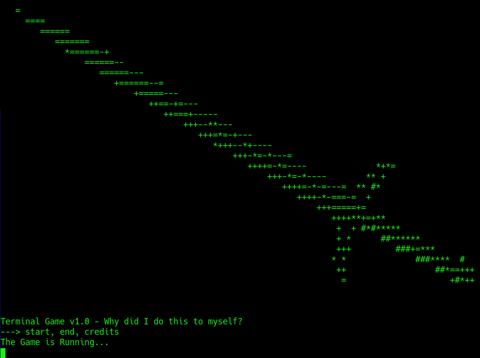

# Riddle Realm - A lazy terminal fantasy game

A fantasy game made for fun in C++20 with goal to merge idle rpg games with riddle solving. 

This project aims to combine solving basic riddles as quests to gain experience, unlock new biomes and grind your way to become the wealthiest adventurer. You will be achieving this by doing quests to gain money and experience for better items and character progression.

## Compiling the game

Bash
```
g++ -std=c++20 -o program2 (include all the files from /src)
```

## Screenshots

